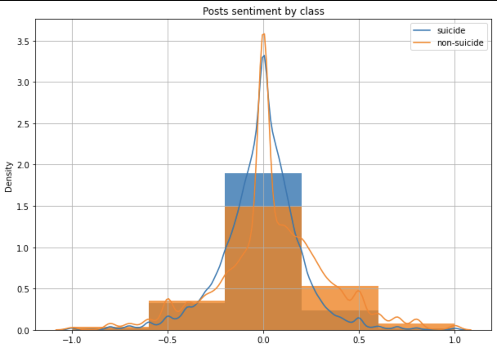

# Using Natural Language Processing to Prediction Suicidal Ideation on Reddit
Applying machine learning classification methods to identify suicidal posts in "SuicideWatch" subreddit.

## Motivation and Business/Social Benefit
Suicide is one of the leading causes of death globally, with an estimated 800,000 deaths annually. That is one death every 40 seconds. A key aspect in suicide prevention is addressing suicidal thoughts and ideas before they turn into actions. By the help of Machine learning, detecting suicidal ideation can assist public health agency in better resource allocation to target people at risk

## Project Contents
Data used in this project can be found [here](https://www.kaggle.com/datasets/nikhileswarkomati/suicide-watch). Below is the information required to reproduce the project:

- `Helper functions` saved as `utils.py`
- Dataset is saved in `_data` folder as `Suicide_Detection.csv`
- `Data cleaning` notebook saved as `data_cleaning.ipynb` (the data produced from this notebook is found in the `_data` folder as `clean_reddit.csv`)
- `Data Processing` notebook found in `processing.ipynb`
- `Modelling` notebook found in `modelling.ipynb`
- `Final report` saved as `report.pdf`

All the packages and libraries required to run the notebooks are saved in `requirements.txt`

## Resources and citations

### Articles
- [Building a suicidal tweet classifier using NLP](https://towardsdatascience.com/building-a-suicidal-tweet-classifier-using-nlp-ff6ccd77e971)
- [Detecting suicidality on Twitter](https://www.sciencedirect.com/science/article/pii/S2214782915000160)
- [Detecting Suicide Ideation in the Era of Social Media](https://www.frontiersin.org/articles/10.3389/fpsyt.2022.652167/full)
- [Tracking suicide risk factors through Twitter in the US](https://pubmed.ncbi.nlm.nih.gov/24121153/)
- ["Right time, right place" health communication on Twitter](https://pubmed.ncbi.nlm.nih.gov/23154246/)
- [Tweeting celebrity suicides](https://pubmed.ncbi.nlm.nih.gov/28705550/)
- [A comparative analysis on suicidal ideation detection using NLP, ML, and DL](https://www.researchgate.net/publication/360271430_A_Comparative_Analysis_on_Suicidal_Ideation_Detection_Using_NLP_Machine_and_Deep_Learning)
- [Suicidal profiles detection in Twitter](https://www.scitepress.org/Papers/2019/81676/81676.pdf)
- [A machine learning approach predicts future risk to suicidal ideation from social media data](https://www.nature.com/articles/s41746-020-0287-6)
- [Systematic review: machine learning and suicidal ideation](https://doi.org/10.1016/j.chb.2021.107095)
- [An unsupervised learning approach for automatically to categorize potential suicide](https://doi.org/10.1109/SCCC49216.2019.8966443)
- [A lexicon-based approach to detecting suicide-related messages on Twitter](https://doi.org/10.1016/j.bspc.2020.102355)
- [Detection of Suicide Ideation in Social Media Forums Using Deep Learning](https://doi.org/10.3390/a13010007)
- [Supervised learning for suicidal ideation detection in online user content](https://doi.org/10.1155/2018/6157249)
- [Machine learning for suicidal ideation identification: A systematic literature review](https://doi.org/10.1016/j.chb.2021.107095)
- [A brief introduction to weakly supervised learning](https://doi.org/10.1093/nsr/nwx106)
"data_cleaning.ipynb" "modelling.ipynb" "report.pdf" "requirements.txt" "utils.py"

### Data Sources
- [Manas et al 2019](https://zenodo.org/record/2667859#.YCwdTR1OlQI)
- [Manas et al 2021](https://doi.org/10.5281/zenodo.4543776)
- [Komati N. 2021](https://www.kaggle.com/datasets/nikhileswarkomati/suicide-watch)
- [Ji S. et al 2021](doi.org/10.5281/zenodo.6476179)

### Repos
- [Suicidal Ideation Detection in Online User Contents](https://github.com/shaoxiongji/sw-detection)
- [Web Spider (Reddit API)](https://github.com/shaoxiongji/webspider)
